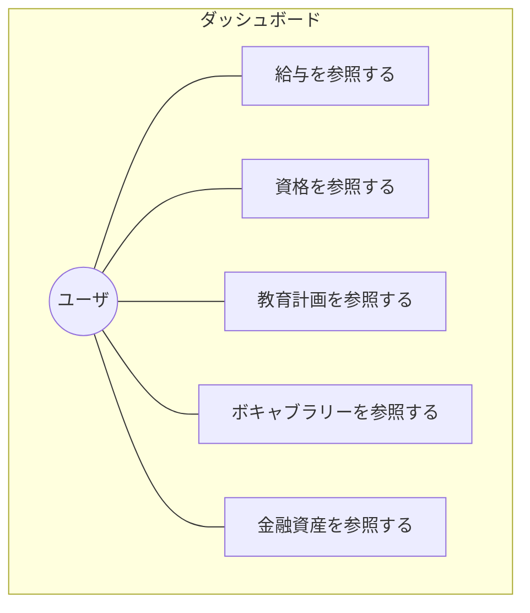
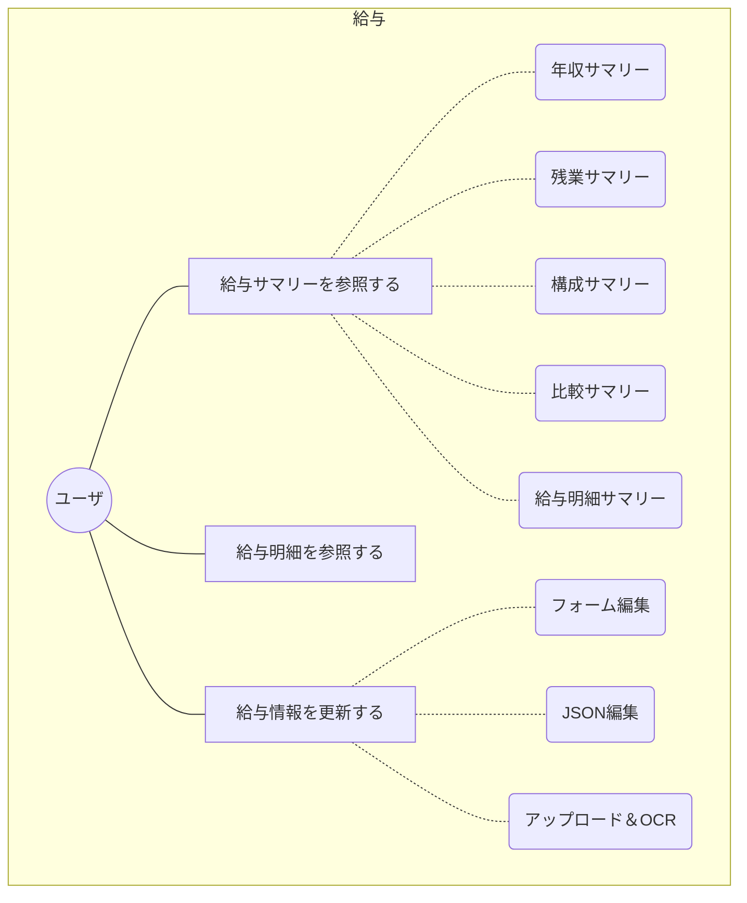
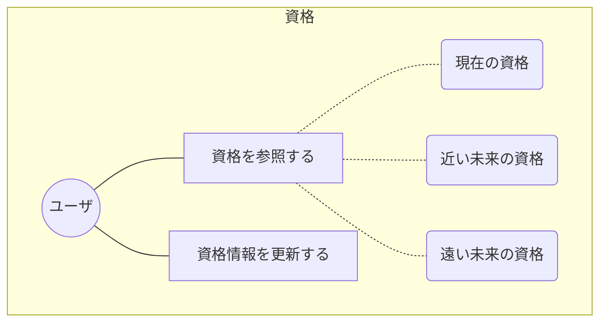
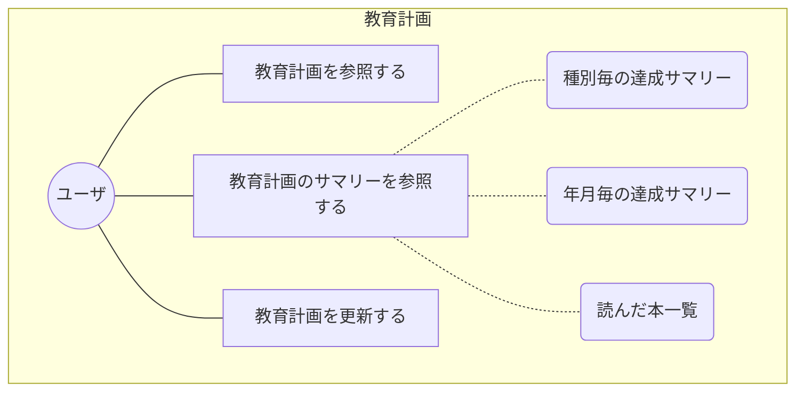
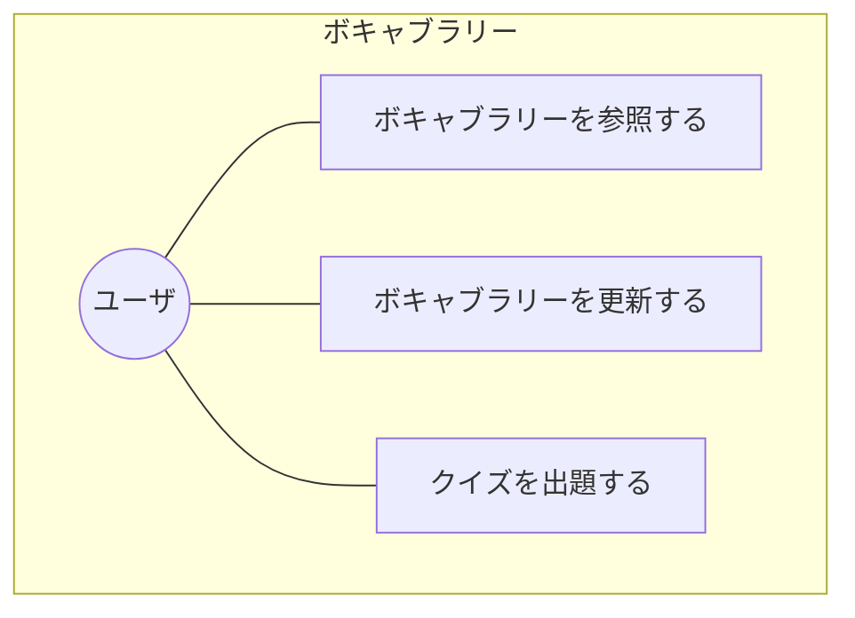
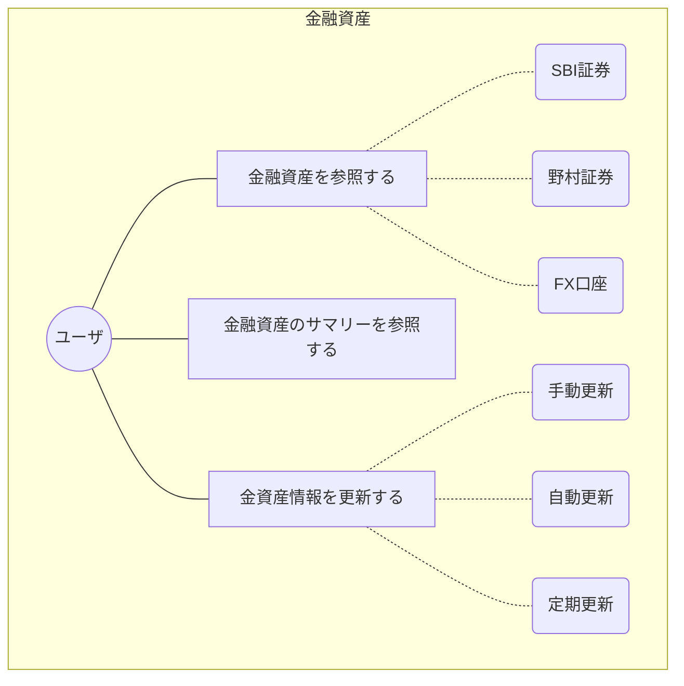

## ダッシュボード

```mermaid
graph TB

    subgraph "ダッシュボード"
        user((ユーザ))
        salary[給与を参照する]
        qualification[資格を参照する]
        educationPlan[教育計画を参照する]
        vocabulary[ボキャブラリーを参照する]
        financialAsset[金融資産を参照する]
    end

    user --- salary
    user --- qualification
    user --- educationPlan
    user --- vocabulary
    user --- financialAsset
```

## 給与

```mermaid
graph TB

    subgraph "給与"
        user((ユーザ))
        summary[給与サマリーを参照する]
        payslip[給与明細を参照する]
        edit[給与情報を更新する]

        yearIncomeSummary(年収サマリー)
        overtimeSummary(残業サマリー)
        structureSummary(構成サマリー)
        compareSummary(比較サマリー)
        payslipSummary(給与明細サマリー)

        formEdit(フォーム編集)
        jsonEdit(JSON編集)
        uploadOcrEdit(アップロード＆OCR)
    end

    user --- summary
    user --- payslip
    user --- edit

    summary -.- yearIncomeSummary
    summary -.- overtimeSummary
    summary -.- structureSummary
    summary -.- compareSummary
    summary -.- payslipSummary

    edit -.- formEdit
    edit -.- jsonEdit
    edit -.- uploadOcrEdit
```

## 資格

```mermaid
graph TB

    subgraph "資格"
        user((ユーザ))
        view[資格を参照する]
        edit[資格情報を更新する]

        acquired(現在の資格)
        planning(近い未来の資格)
        dream(遠い未来の資格)
    end

    user --- view
    user --- edit

    view -.- acquired
    view -.- planning
    view -.- dream
```

## 教育計画

```mermaid
graph TB

    subgraph "教育計画"
        user((ユーザ))
        view[教育計画を参照する]
        summary[教育計画のサマリーを参照する]
        edit[教育計画を更新する]

        achievementByDivision(種別毎の達成サマリー)
        achievementByYearMonth(年月毎の達成サマリー)
        readBooks(読んだ本一覧)
    end

    user --- view
    user --- summary
    user --- edit

    summary -.- achievementByDivision
    summary -.- achievementByYearMonth
    summary -.- readBooks
```

## ボキャブラリー

```mermaid
graph TB

    subgraph "ボキャブラリー"
        user((ユーザ))
        view[ボキャブラリーを参照する]
        edit[ボキャブラリーを更新する]
        quiz[クイズを出題する]
    end

    user --- view
    user --- edit
    user --- quiz
```

## 金融資産

```mermaid
graph TB

    subgraph "金融資産"
        user((ユーザ))
        view[金融資産を参照する]
        summary[金融資産のサマリーを参照する]
        update[金資産情報を更新する]

        sbi(SBI証券)
        nomura(野村証券)
        fx(FX口座)

        manualUpdate(手動更新)
        automaticUpdate(自動更新)
        regularUpdate(定期更新)
    end

    user --- view
    user --- summary
    user --- update

    view -.- sbi
    view -.- nomura
    view -.- fx

    update -.- manualUpdate
    update -.- automaticUpdate
    update -.- regularUpdate
```
