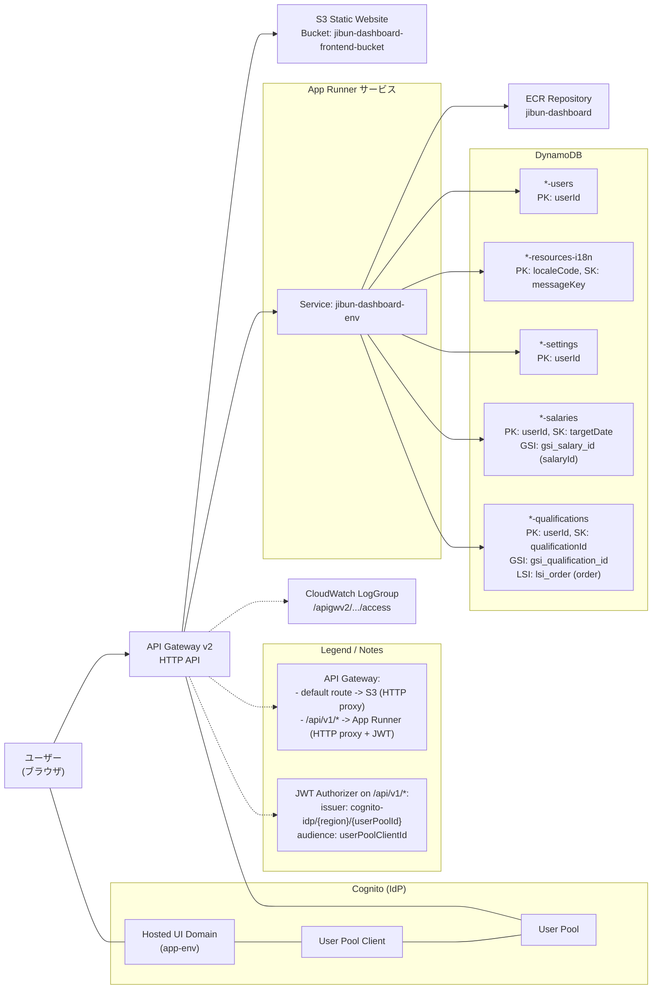
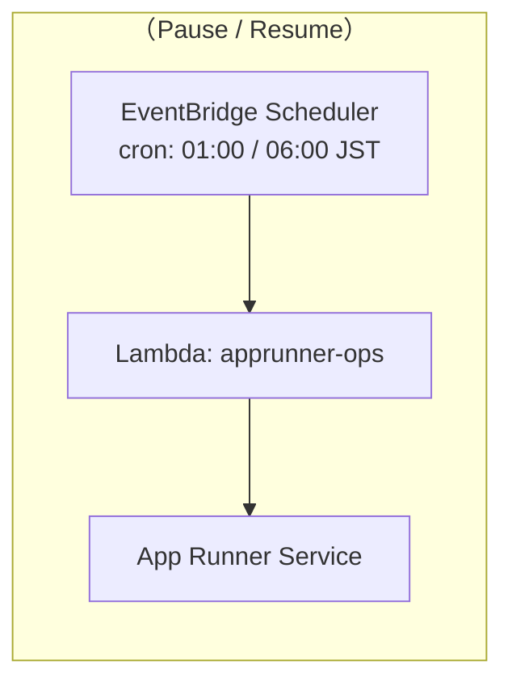

## インフラ全体図

```mermaid
%%{init: {'flowchart': {'htmlLabels': false}} }%%
flowchart LR

  U["ユーザー<br>(ブラウザ)"]

  AGW["API Gateway v2<br>HTTP API"]
  LG["CloudWatch LogGroup<br>/apigwv2/.../access"]

  S3["S3 Static Website<br>Bucket: jibun-dashboard-frontend-bucket"]

  subgraph COG["Cognito (IdP)"]
    CPool["User Pool"]
    CClient["User Pool Client"]
    CDomain["Hosted UI Domain<br>(app-env)"]
  end

  subgraph AR["App Runner サービス"]
    ARS["Service: jibun-dashboard-env"]
  end
  ECR["ECR Repository<br>jibun-dashboard"]

  subgraph DDB["DynamoDB"]
    DUsers["*-users<br>PK: userId"]
    DR18n["*-resources-i18n<br>PK: localeCode, SK: messageKey"]
    DSettings["*-settings<br>PK: userId"]
    DSalaries["*-salaries<br>PK: userId, SK: targetDate<br>GSI: gsi_salary_id (salaryId)"]
    DQuals["*-qualifications<br>PK: userId, SK: qualificationId<br>GSI: gsi_qualification_id<br>LSI: lsi_order (order)"]
  end

  %% ルーティング（リンクラベル無し）
  U --> AGW
  AGW --> S3
  AGW --> ARS
  AGW -.-> LG

  %% 認証フロー（概略）
  U --- CDomain
  CDomain --- CClient
  CClient --- CPool
  AGW --- CPool

  %% バックエンド依存
  ARS --> ECR
  ARS --> DUsers
  ARS --> DR18n
  ARS --> DSettings
  ARS --> DSalaries
  ARS --> DQuals

  %% 凡例（テキストノード）
  subgraph LEGEND["Legend / Notes"]
    L1["API Gateway:<br>- default route -> S3 (HTTP proxy)<br>- /api/v1/* -> App Runner (HTTP proxy + JWT)"]
    L2["JWT Authorizer on /api/v1/*:<br>issuer: cognito-idp/{region}/{userPoolId}<br>audience: userPoolClientId"]
  end

  AGW -.-> L1
  AGW -.-> L2
```

## 運用オートメーション

```mermaid
%%{init: {'flowchart': {'htmlLabels': false}} }%%
flowchart LR

  subgraph OPS["（Pause / Resume）"]
    SCH["EventBridge Scheduler<br>cron: 01:00 / 06:00 JST"]
    LAMBDA["Lambda: apprunner-ops"]
    ARS["App Runner Service"]
  end

  SCH --> LAMBDA
  LAMBDA --> ARS
```
