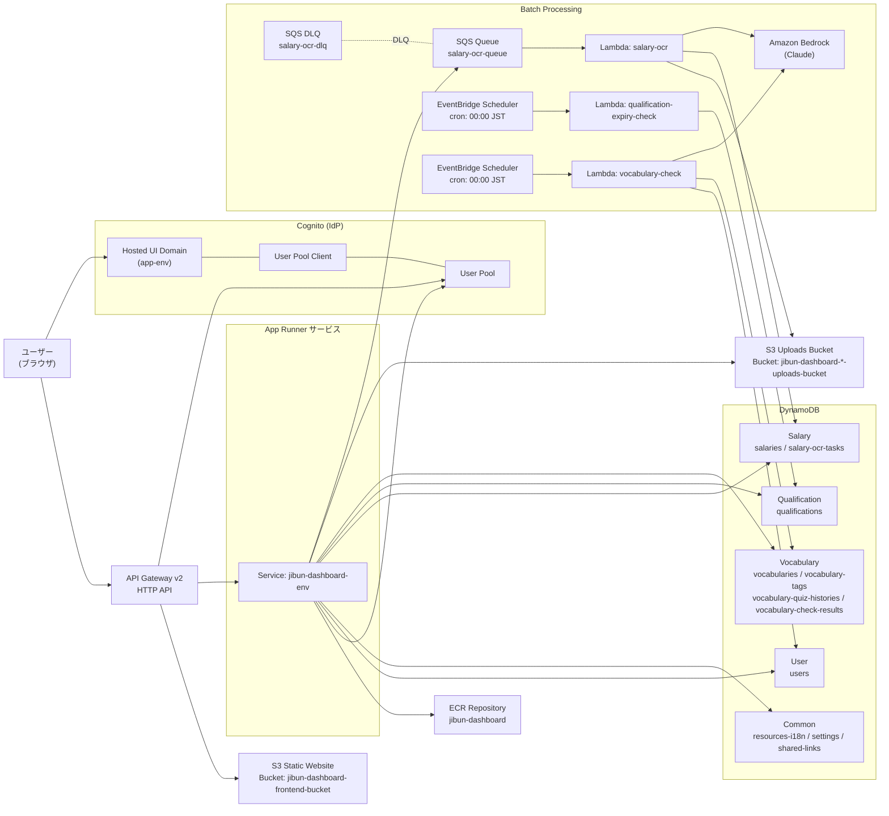
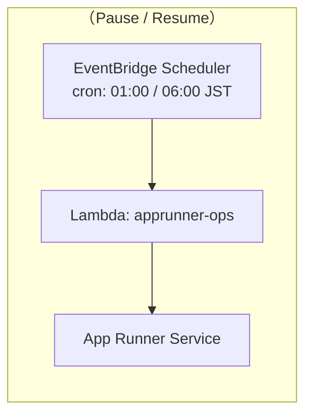
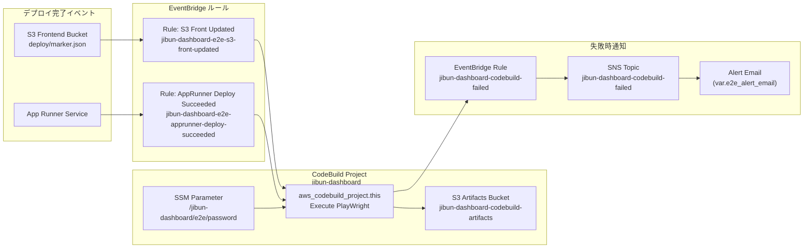

## インフラ全体図

```mermaid
%%{init: {'flowchart': {'htmlLabels': false}} }%%
flowchart LR

  U["ユーザー<br>(ブラウザ)"]

  AGW["API Gateway v2<br>HTTP API"]

  S3_FRONT["S3 Static Website<br>Bucket: jibun-dashboard-frontend-bucket"]
  S3_UP["S3 Uploads Bucket<br>Bucket: jibun-dashboard-*-uploads-bucket"]

  subgraph COG["Cognito (IdP)"]
    CPool["User Pool"]
    CClient["User Pool Client"]
    CDomain["Hosted UI Domain<br>(app-env)"]
  end

  subgraph AR["App Runner サービス"]
    ARS["Service: jibun-dashboard-env"]
  end

  ECR["ECR Repository<br>jibun-dashboard"]

  subgraph DDB["DynamoDB"]
    DDBU["User<br>users"]
    DDBC["Common<br>resources-i18n / settings / shared-links"]
    DDBS["Salary<br>salaries / salary-ocr-tasks"]
    DDBQ["Qualification<br>qualifications"]
    DDBV["Vocabulary<br>vocabularies / vocabulary-tags<br>vocabulary-quiz-histories / vocabulary-check-results"]
  end

  subgraph BATCH["Batch Processing"]
    Q_DLQ["SQS DLQ<br>salary-ocr-dlq"]
    Q_MAIN["SQS Queue<br>salary-ocr-queue"]
    L_SAL["Lambda: salary-ocr"]
    SCH_EXP["EventBridge Scheduler<br>cron: 00:00 JST"]
    L_EXP["Lambda: qualification-expiry-check"]
    SCH_VOCAB["EventBridge Scheduler<br>cron: 00:00 JST"]
    L_VOCAB["Lambda: vocabulary-check"]
    BED["Amazon Bedrock<br>(Claude)"]
  end

  %% ルーティング（リンクラベル無し）
  U --> AGW
  AGW --> S3_FRONT
  AGW --> ARS

  %% 認証フロー（概略）
  U --> CDomain
  CDomain --- CClient
  CClient --- CPool
  AGW --> CPool

  %% バックエンド依存
  ARS --> ECR
  ARS --> CPool
  ARS --> DDBU
  ARS --> DDBC
  ARS --> DDBS
  ARS --> DDBQ
  ARS --> DDBV
  ARS --> S3_UP

  %% 給与OCRバッチフロー
  ARS --> Q_MAIN
  Q_MAIN --> L_SAL
  Q_DLQ -. DLQ .- Q_MAIN

  L_SAL --> S3_UP
  L_SAL --> DDBS
  L_SAL --> BED

  %% 資格期限確認バッチフロー
  SCH_EXP --> L_EXP
  L_EXP --> DDBQ

  %% ボキャブラリーチェックバッチフロー
  SCH_VOCAB --> L_VOCAB
  L_VOCAB --> DDBU
  L_VOCAB --> DDBV
  L_VOCAB --> BED
```

## 運用オートメーション

```mermaid
%%{init: {'flowchart': {'htmlLabels': false}} }%%
flowchart LR

  subgraph OPS["（Pause / Resume）"]
    SCH["EventBridge Scheduler<br>cron: 01:00 / 06:00 JST"]
    LAMBDA["Lambda: apprunner-ops"]
    ARS["App Runner Service"]
  end

  SCH --> LAMBDA
  LAMBDA --> ARS
```

## E2Eテスト

```mermaid
%%{init: {'flowchart': {'htmlLabels': false}} }%%
flowchart LR

  subgraph SRC["デプロイ完了イベント"]
    S3_FRONT["S3 Frontend Bucket<br>deploy/marker.json"]
    ARS["App Runner Service"]
  end

  subgraph EV["EventBridge ルール"]
    EV_S3["Rule: S3 Front Updated<br>jibun-dashboard-e2e-s3-front-updated"]
    EV_AR["Rule: AppRunner Deploy Succeeded<br>jibun-dashboard-e2e-apprunner-deploy-succeeded"]
  end

  subgraph CB["CodeBuild Project<br>jibun-dashboard"]
    CB_PJT["aws_codebuild_project.this<br>Execute PlayWright"]
    SSM_E2E["SSM Parameter<br>/jibun-dashboard/e2e/password"]
    S3_ART["S3 Artifacts Bucket<br>jibun-dashboard-codebuild-artifacts"]
  end

  subgraph NOTIFY["失敗時通知"]
    EV_CB_FAIL["EventBridge Rule<br>jibun-dashboard-codebuild-failed"]
    SNS["SNS Topic<br>jibun-dashboard-codebuild-failed"]
    EMAIL["Alert Email<br>(var.e2e_alert_email)"]
  end

  %% トリガー: S3 / App Runner → CodeBuild
  S3_FRONT --> EV_S3
  ARS --> EV_AR

  EV_S3 --> CB_PJT
  EV_AR --> CB_PJT

  %% CodeBuild 実行・依存
  SSM_E2E --> CB_PJT
  CB_PJT --> S3_ART

  %% 失敗時通知フロー
  CB_PJT --> EV_CB_FAIL
  EV_CB_FAIL --> SNS
  SNS --> EMAIL
```
